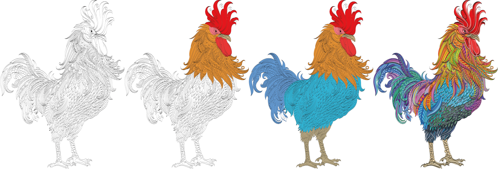
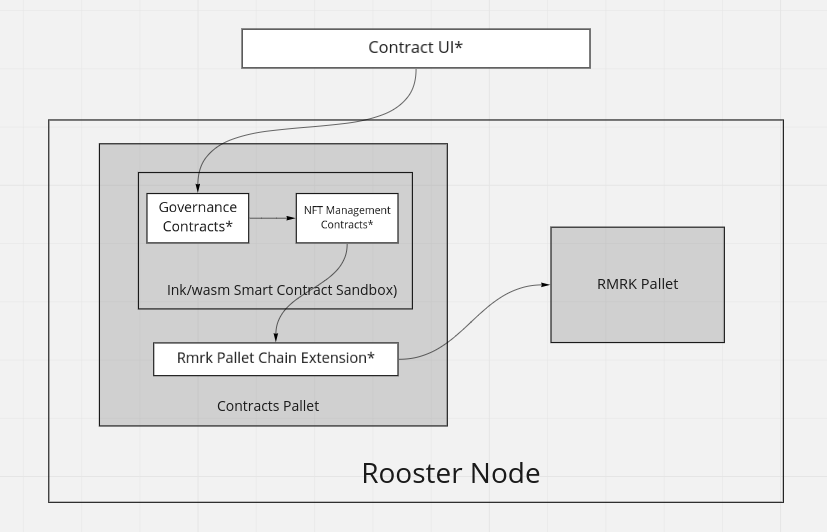
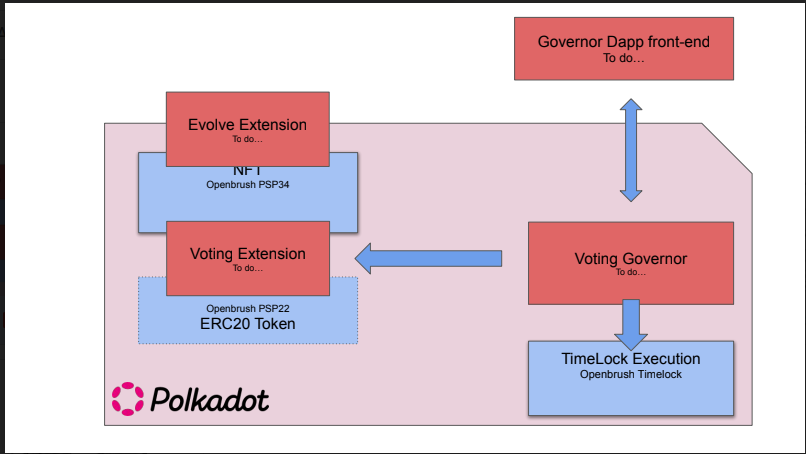
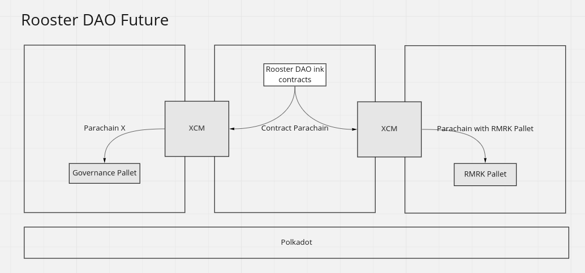

# Rooster DAO

  

## Demo
You can access the [demo website here](https://hack.dwellir.com/)  
The substrate node endpoint can also be accessed publicly at `wss://api1.dwellir.com/hack-na/rooster` via [Polkadot.js.org](https://polkadot.js.org/apps/?rpc=wss%3A%2F%2Fapi1.dwellir.com%2Fhack-na%2Frooster#/)

## Inspiration
We found some inspiration out of existing investment Dao’s on Ethereum like The Lao or Dao5.
We felt that Polkadot has room for a good investment Dao that is solely focused on the Dotsama ecosystem, because Dotsama is becoming one of the fastest growing ecosystems that potentially become a new standard in the space.

## What it does
Rooster Dao is an investment fund managed as a Dao, that focusses solely on investments in the Dotsama ecosystem.
The Dao is designed to incentivise heavily participation. It does this in two ways.
Each member owns an evolving NFT, the evolvement of the NFT represents the degree of participation in proposals for investment or votes on proposals. By participating, the image of a rooster gains color and levels up (see uploaded images).
When a member proposes an investment that turns out to be very beneficial for the Dao. All members of the Dao transfer a small amount of the profits of that investment to the member who made the proposal.
With these two mechanisms, we create a horizontal structure where proposals are heavily incentivised with a meaningful financial reward and a visual representation of the efforts.

## Technical Overview

// TODO: Make changes to this

## How we built it
### Contracts UI
// TODO: Details about contracts UI

### Ink/WASM smart contracts
We wanted to hack with Ink/Wasm smart contracts since we believe it is the future (and we wanted to have some fun!). 
We wrote our own governance contract, used it with Openbrush timelock and wrote ink chain extension functions to interact with RMRK Pallet. 

#### Governance Contracts
// TODO: Details about governance

#### NFT Management Contracts
We used chain extensions to interact with rmrk pallet in order to 
- Create collection owned by the contract itself
- Mint NFT and transfer it to the new owner
- Verify Owner
- Add resource to the NFT
- Remove resource from the NFT

### Rooster Node
We built a custom node for the hackathon using substrate with contracts pallet, rmrk pallet and chain extension functions in the runtime to interact with RMRK pallet. 

## Challenges we ran into
### Deployment target for our Smart contracts
We needed a place to deploy our smart contracts but we also needed to interact with RMRK pallets. We had conversations with Acala, Astar and RMRK team and this is what we learned:
Acala plans to deploy rmrk-pallet and contract pallets in future but they have no timeline yet.
Astar has deployed contracts-pallet on Shibuya and Shiden, but they don't intend to deploy RMRK pallets.
RMRK encouraged us to play with rmrk pallets and not to go with a centralised solution to work with RMRK NFTs. 

We were a bit back and forth about our architecture but finally decided for the hackathon/POC version to build our own substrate node with contracts-pallet and rmrk pallet. 

### Chain Extensions
We struggled a lot to move complex data structures in and out of pallets. We found lot of inspiration from the Astar Chain Extension demo and idealabs code and started using a pattern to use very simple datastructures to send/receive via chain extensions. 
We also struggled to pass string (Non Bounded Vec) from smart contract to the pallet functions which accepted BoundedVec. Substrate StackExchange was incredibly helpful in getting past these roadblocks.

### Evolution of RMRK NFTs
Evolution of RMRK NFTs is based on the fact that collection owner replaces a resource (which is the old level) of the NFT with a new resource (the new level).
To replace a resource, the collection owner adds a new resource and pass the ID of a resource that the NFT already has and that wants to be replaced.
The functions on RMRK to add a new resource are "addBasicResource", "addComposableResource" and "addSlotResource".

Passing a resource ID as a parameter to these functions is not currently implemented, so it is not possible to replace a resource using these functions.
To evolve the NFT we decided to add a new resource which will have its own unique ID and then remove the previous resource (the previous level) of the NFT.

// TODO: Other challenges?

## Accomplishments that we're proud of
We are really proud to be able to write our business logic in Ink instead of solidity and also trustlessly being able to interact/evolve RMRK NFTs instead of using a centralised solution. 

## What we learned
We have learned so much over the course of hackathon. Few big things -
- Using ink smart contracts
- Chain Extensions
- RMRK NFTs
- Understanding more about how substrate node works (like runtime being on-chain wasm code and easily upgradable)

## What's next for Rooster DAO
We have ambitions to utilise XCM to build a truly multi-chain dapp in the spirit of Polkadot and use aUSD as base currency for all transaction. We want to keep exploring and get feedback from more teams, but we have some idea of how we may look in future

This architecture is powerful since,
- Contract Parachain could be a chain like Astar/Gear where we deploy our smart contract code that may be updated frequently.
- We could interact with RMRK pallet on multiple parachain (like Acala) who choose to deploy their pallet.
- We could utilise a Governance Pallet for our governance functions on another Parachain X. This could be for example, Zeitgeist futarchy-based governance pallet. Or may be our own custom rooster governance pallet on some parachain. A user while creating a DAO can choose which type of governance they want in the DAO.

## Built with
// TODO: Add frontend tech      
Rust, Substrate, ChainExtensions, RMRK, Ink

## Special Mentions
- Astar's Chain extension demo by Pierre Ossun.
- The guys at SuperColony/Openbrush for answering our questions about Ink.
- Bruno from RMRK for encouraging us to use RMRK pallets.
- Dwellir for helping us with infrastructure and supporting our team for the Hackathon
